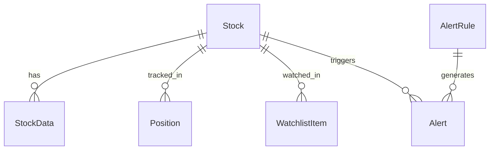
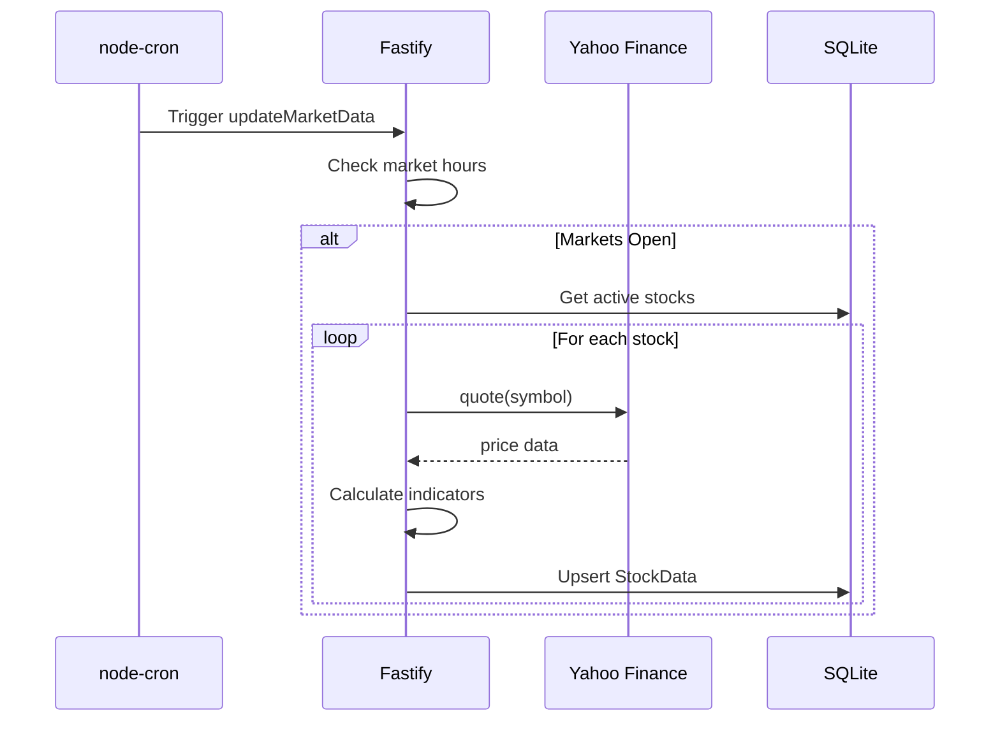
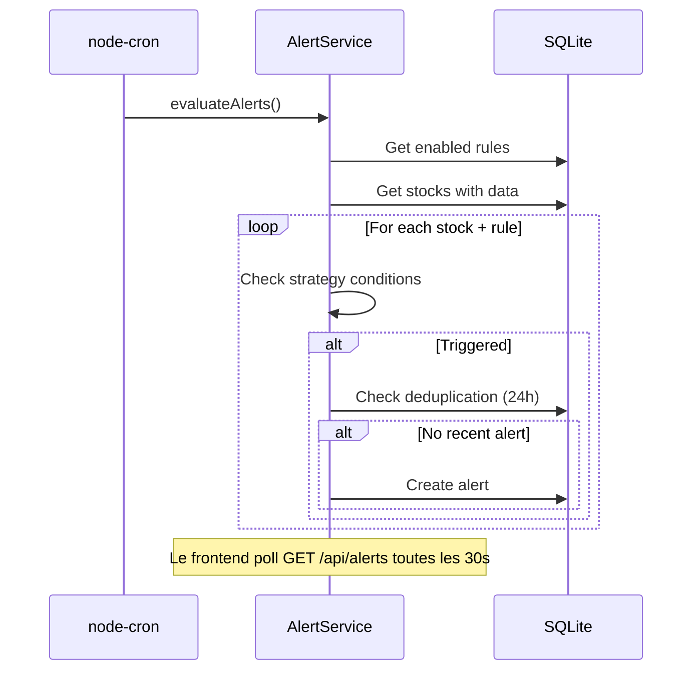

# Looptrading - Architecture Document

## 1. Introduction

Ce document décrit l'architecture de **LoopTrading**, une application web personnelle de swing trading. Simplicité maximale.

### Change Log

| Date | Version | Description | Author |
|------|---------|-------------|--------|
| 2026-01-25 | 1.0 | Création initiale | Winston (Architect) |
| 2026-01-25 | 2.0 | Simplification : suppression IBKR, Docker, Redis | Winston (Architect) |
| 2026-01-25 | 3.0 | Simplification maximale : port unique, pas de monorepo, pas de WebSocket | Winston (Architect) |

---

## 2. High Level Architecture

### 2.1 Technical Summary

Looptrading est une application **monolithique simple** déployée localement :

- **Frontend** : React 18 (Vite en dev, servi par Fastify en prod)
- **Backend** : Fastify + Prisma + SQLite
- **Temps réel** : Polling via TanStack Query (pas de WebSocket)
- **Port unique** : localhost:3000

**Démarrage :** `pnpm start` - C'est tout !

### 2.2 Platform and Infrastructure

| Service | Solution |
|---------|----------|
| Runtime | Node.js 20+ LTS |
| Database | SQLite (fichier local) |
| Market Data | Yahoo Finance API (gratuit) |
| Scheduling | node-cron (in-process) |

### 2.3 Repository Structure

```
looptrading/
├── src/
│   ├── client/              # Frontend React
│   ├── server/              # Backend Fastify
│   └── shared/              # Types partagés
├── prisma/
│   └── schema.prisma
├── package.json             # Un seul fichier
├── vite.config.ts
└── tsconfig.json
```

### 2.4 Architecture Diagram

```mermaid
graph TB
    subgraph "User Machine - localhost:3000"
        FASTIFY[Fastify]
        FASTIFY -->|sert| REACT[React SPA]
        FASTIFY -->|expose| API[/api/*]
        SCHED[node-cron] --> FASTIFY
        FASTIFY --> DB[(SQLite)]
    end

    YAHOO[Yahoo Finance API]
    FASTIFY --> YAHOO
    REACT -->|fetch + polling| API
```

### 2.5 Architectural Patterns

| Pattern | Description | Rationale |
|---------|-------------|-----------|
| Monolith Simple | Tout dans un process | Simplicité maximale |
| Polling | TanStack Query refetch 30s | Pas besoin de WebSocket |
| Service Layer | Logique métier isolée | Testabilité |
| In-Memory Cache | Cache des prix Yahoo | Rate limiting |

---

## 3. Tech Stack

| Category | Technology | Version | Purpose |
|----------|------------|---------|---------|
| Language | TypeScript | 5.x | Typage statique |
| Frontend | React | 18.x | UI Components |
| Build Tool | Vite | 5.x | Dev server & bundling |
| Styling | TailwindCSS | 3.x | Utility-first CSS |
| Charts | TradingView Lightweight Charts | 4.x | Graphiques financiers |
| Data Fetching | TanStack Query | 5.x | Cache, sync & polling |
| Tables | TanStack Table | 8.x | Tableaux interactifs |
| Routing | React Router | 6.x | Navigation SPA |
| Backend | Fastify | 4.x | API REST + Static files |
| ORM | Prisma | 5.x | Accès DB |
| Database | SQLite | 3.x | Persistance |
| Validation | Zod | 3.x | Schémas validation |
| Scheduler | node-cron | 3.x | Tâches planifiées |
| Market Data | yahoo-finance2 | 2.x | Prix, historique, news |
| Package Manager | pnpm | 8.x | Gestion dépendances |
| Testing | Vitest | 1.x | Tests unitaires |
| Linting | ESLint | 9.x | Qualité code |
| Formatting | Prettier | 3.x | Formatage |

**Supprimés volontairement :** Turborepo, Socket.io, Zustand, Supertest

---

## 4. Data Models

### 4.1 Stock (Universe)

```typescript
interface Stock {
  symbol: string;        // PK - ex: "AAPL", "MC.PA"
  name: string;
  market: "US" | "EU";
  sector?: string;
  active: boolean;
  createdAt: Date;
  updatedAt: Date;
}
```

### 4.2 StockData

```typescript
interface StockData {
  id: string;
  symbol: string;
  date: Date;

  // OHLCV
  open: number;
  high: number;
  low: number;
  close: number;
  volume: number;

  // Indicateurs
  sma20?: number;
  sma50?: number;
  sma200?: number;
  ema9?: number;
  ema21?: number;
  rsi14?: number;
  macdLine?: number;
  macdSignal?: number;
  macdHistogram?: number;
  bollingerUpper?: number;
  bollingerMiddle?: number;
  bollingerLower?: number;
  obv?: number;
  avgVolume20?: number;

  // Score
  score?: number;
  updatedAt: Date;
}
```

### 4.3 Position (Portfolio manuel)

```typescript
interface Position {
  id: string;
  symbol: string;
  quantity: number;
  avgCost: number;
  dateAcquired?: Date;
  notes?: string;
  createdAt: Date;
  updatedAt: Date;
}
```

### 4.4 WatchlistItem

```typescript
interface WatchlistItem {
  id: string;
  symbol: string;
  order: number;
  targetPriceHigh?: number;
  targetPriceLow?: number;
  notes?: string;
  createdAt: Date;
  updatedAt: Date;
}
```

### 4.5 AlertRule

```typescript
interface AlertRule {
  id: string;
  strategy: "PULLBACK" | "BREAKOUT" | "MACD_CROSS" | "SCORE_THRESHOLD";
  params: Record<string, any>;
  enabled: boolean;
  createdAt: Date;
  updatedAt: Date;
}
```

### 4.6 Alert

```typescript
interface Alert {
  id: string;
  symbol: string;
  strategy: string;
  score?: number;
  message: string;
  triggeredAt: Date;
  acknowledged: boolean;
  acknowledgedAt?: Date;
}
```

### 4.7 UserSettings

```typescript
interface UserSettings {
  id: string;  // "default"

  // Alertes
  strategyPullback: boolean;
  strategyBreakout: boolean;
  strategyMacdCross: boolean;
  minScoreAlert: number;

  // Notifications
  emailEnabled: boolean;
  emailAddress?: string;
  pushEnabled: boolean;

  // Quiet hours
  quietHoursEnabled: boolean;
  quietHoursStart?: string;
  quietHoursEnd?: string;

  updatedAt: Date;
}
```

### 4.8 Relations



---

## 5. API Specification

### 5.1 Base URL

```
http://localhost:3000/api
```

### 5.2 Endpoints

| Method | Endpoint | Description |
|--------|----------|-------------|
| GET | `/health` | Health check |
| **Stocks** | | |
| GET | `/stocks` | Liste des actions |
| POST | `/stocks` | Ajouter une action |
| DELETE | `/stocks/:symbol` | Retirer une action |
| POST | `/stocks/import` | Import CSV bulk |
| GET | `/stocks/:symbol/quote` | Prix actuel |
| GET | `/stocks/:symbol/history` | Historique OHLCV |
| GET | `/stocks/:symbol/indicators` | Indicateurs |
| GET | `/stocks/:symbol/score` | Score détaillé |
| **Screener** | | |
| GET | `/screener` | Liste filtrée |
| **Portfolio** | | |
| GET | `/portfolio/positions` | Liste positions + P&L |
| POST | `/portfolio/positions` | Ajouter position |
| PUT | `/portfolio/positions/:id` | Modifier |
| DELETE | `/portfolio/positions/:id` | Supprimer |
| POST | `/portfolio/import` | Import CSV |
| GET | `/portfolio/template` | Template CSV |
| **Watchlist** | | |
| GET | `/watchlist` | Liste |
| POST | `/watchlist` | Ajouter |
| PUT | `/watchlist/:id` | Modifier |
| DELETE | `/watchlist/:id` | Supprimer |
| PUT | `/watchlist/reorder` | Réordonner |
| **Alerts** | | |
| GET | `/alerts` | Liste alertes |
| GET | `/alerts/rules` | Règles |
| PUT | `/alerts/rules/:id` | Modifier règle |
| PUT | `/alerts/:id/acknowledge` | Acquitter |
| **News** | | |
| GET | `/news` | News watchlist |
| GET | `/news/:symbol` | News par action |
| **Settings** | | |
| GET | `/settings` | Récupérer |
| PUT | `/settings` | Modifier |

### 5.3 Screener Query Parameters

```
GET /api/screener?minScore=70&maxRsi=70&aboveSma50=true&market=US&sortBy=score&sortOrder=desc&limit=50
```

| Param | Type | Description |
|-------|------|-------------|
| minScore | number | Score minimum |
| maxScore | number | Score maximum |
| minRsi | number | RSI minimum |
| maxRsi | number | RSI maximum |
| aboveSma50 | boolean | Prix > SMA50 |
| aboveSma200 | boolean | Prix > SMA200 |
| minVolume | number | Ratio volume |
| market | US\|EU\|ALL | Marché |
| sortBy | string | Tri |
| sortOrder | asc\|desc | Ordre |
| limit | number | Max 100 |
| offset | number | Pagination |

### 5.4 Response Format

**Success:**
```json
{
  "data": { ... },
  "meta": { "total": 234, "limit": 50, "offset": 0 }
}
```

**Error:**
```json
{
  "error": {
    "code": "VALIDATION_ERROR",
    "message": "Invalid symbol format"
  }
}
```

---

## 6. Project Structure

```
looptrading/
├── src/
│   ├── client/                  # Frontend React
│   │   ├── main.tsx
│   │   ├── App.tsx
│   │   ├── components/
│   │   │   ├── Layout.tsx
│   │   │   ├── Navbar.tsx
│   │   │   ├── StockChart.tsx
│   │   │   ├── StockTable.tsx
│   │   │   ├── AlertBadge.tsx
│   │   │   └── ...
│   │   ├── pages/
│   │   │   ├── Dashboard.tsx
│   │   │   ├── Screener.tsx
│   │   │   ├── Watchlist.tsx
│   │   │   ├── Portfolio.tsx
│   │   │   ├── StockDetail.tsx
│   │   │   └── Settings.tsx
│   │   ├── hooks/
│   │   │   ├── useStocks.ts
│   │   │   ├── useAlerts.ts
│   │   │   └── usePortfolio.ts
│   │   └── lib/
│   │       └── api.ts           # Client API fetch
│   │
│   ├── server/                  # Backend Fastify
│   │   ├── index.ts             # Entry point
│   │   ├── app.ts               # Fastify setup
│   │   ├── routes/
│   │   │   ├── health.ts
│   │   │   ├── stocks.ts
│   │   │   ├── screener.ts
│   │   │   ├── portfolio.ts
│   │   │   ├── watchlist.ts
│   │   │   ├── alerts.ts
│   │   │   ├── news.ts
│   │   │   └── settings.ts
│   │   ├── services/
│   │   │   ├── MarketDataService.ts
│   │   │   ├── IndicatorService.ts
│   │   │   ├── ScoringService.ts
│   │   │   ├── AlertService.ts
│   │   │   ├── SchedulerService.ts
│   │   │   └── CacheService.ts
│   │   └── utils/
│   │       ├── indicators.ts    # SMA, EMA, RSI, MACD, etc.
│   │       └── marketHours.ts
│   │
│   └── shared/                  # Types partagés
│       └── types.ts
│
├── prisma/
│   ├── schema.prisma
│   └── seed.ts
├── dist/                        # Build output (gitignored)
├── package.json
├── tsconfig.json
├── vite.config.ts
└── .env
```

---

## 7. External APIs

### Yahoo Finance (yahoo-finance2)

| Usage | Method |
|-------|--------|
| Prix temps réel | `quote()` |
| Historique OHLCV | `historical()` |
| News | `search()` |

**Rate Limit:** ~2000/heure (respecter avec cache)

**Suffixes marchés:**
- US: `AAPL`, `MSFT`
- Paris: `MC.PA`, `OR.PA`
- Frankfurt: `SAP.DE`

---

## 8. Core Workflows

### 8.1 Market Data Update (every 15 min)



### 8.2 Alert Evaluation (every 15 min)



---

## 9. Database Schema (Prisma)

```prisma
generator client {
  provider = "prisma-client-js"
}

datasource db {
  provider = "sqlite"
  url      = env("DATABASE_URL")
}

model Stock {
  symbol    String   @id
  name      String
  market    String
  sector    String?
  active    Boolean  @default(true)
  createdAt DateTime @default(now())
  updatedAt DateTime @updatedAt

  data      StockData[]
  positions Position[]
  watchlist WatchlistItem[]
  alerts    Alert[]

  @@index([market, active])
}

model StockData {
  id        String   @id @default(cuid())
  symbol    String
  date      DateTime

  open      Float
  high      Float
  low       Float
  close     Float
  volume    Float

  sma20     Float?
  sma50     Float?
  sma200    Float?
  ema9      Float?
  ema21     Float?
  rsi14     Float?
  macdLine  Float?
  macdSignal Float?
  macdHist  Float?
  bbUpper   Float?
  bbMiddle  Float?
  bbLower   Float?
  obv       Float?
  avgVol20  Float?
  score     Int?

  updatedAt DateTime @updatedAt
  stock     Stock    @relation(fields: [symbol], references: [symbol], onDelete: Cascade)

  @@unique([symbol, date])
  @@index([symbol, date])
}

model Position {
  id           String   @id @default(cuid())
  symbol       String
  quantity     Float
  avgCost      Float
  dateAcquired DateTime?
  notes        String?
  createdAt    DateTime @default(now())
  updatedAt    DateTime @updatedAt

  stock        Stock    @relation(fields: [symbol], references: [symbol], onDelete: Cascade)
}

model WatchlistItem {
  id              String   @id @default(cuid())
  symbol          String   @unique
  order           Int      @default(0)
  targetPriceHigh Float?
  targetPriceLow  Float?
  notes           String?
  createdAt       DateTime @default(now())
  updatedAt       DateTime @updatedAt

  stock           Stock    @relation(fields: [symbol], references: [symbol], onDelete: Cascade)
}

model AlertRule {
  id        String   @id @default(cuid())
  strategy  String   @unique
  params    String
  enabled   Boolean  @default(true)
  createdAt DateTime @default(now())
  updatedAt DateTime @updatedAt
}

model Alert {
  id            String   @id @default(cuid())
  symbol        String
  strategy      String
  score         Int?
  message       String
  triggeredAt   DateTime @default(now())
  acknowledged  Boolean  @default(false)
  acknowledgedAt DateTime?

  stock         Stock    @relation(fields: [symbol], references: [symbol], onDelete: Cascade)

  @@index([symbol, strategy, triggeredAt])
  @@index([acknowledged])
}

model UserSettings {
  id                 String  @id @default("default")
  strategyPullback   Boolean @default(true)
  strategyBreakout   Boolean @default(true)
  strategyMacdCross  Boolean @default(true)
  minScoreAlert      Int     @default(75)
  emailEnabled       Boolean @default(false)
  emailAddress       String?
  pushEnabled        Boolean @default(true)
  quietHoursEnabled  Boolean @default(false)
  quietHoursStart    String?
  quietHoursEnd      String?
  updatedAt          DateTime @updatedAt
}
```

---

## 10. Frontend Architecture

### 10.1 Data Fetching (TanStack Query)

```typescript
// hooks/useAlerts.ts
import { useQuery } from '@tanstack/react-query';
import { api } from '../lib/api';

export function useAlerts() {
  return useQuery({
    queryKey: ['alerts'],
    queryFn: () => api.get('/alerts').then(r => r.data),
    refetchInterval: 30_000, // Polling toutes les 30s
  });
}

// Compteur d'alertes non lues = dérivé des données
const unreadCount = alerts?.filter(a => !a.acknowledged).length ?? 0;
```

### 10.2 Routing

```typescript
// App.tsx
<BrowserRouter>
  <Layout>
    <Routes>
      <Route path="/" element={<Dashboard />} />
      <Route path="/screener" element={<Screener />} />
      <Route path="/watchlist" element={<Watchlist />} />
      <Route path="/portfolio" element={<Portfolio />} />
      <Route path="/stocks/:symbol" element={<StockDetail />} />
      <Route path="/settings" element={<Settings />} />
    </Routes>
  </Layout>
</BrowserRouter>
```

### 10.3 API Client

```typescript
// lib/api.ts
const BASE_URL = '/api'; // Même origine, pas de CORS

export const api = {
  get: (path: string) => fetch(BASE_URL + path).then(r => r.json()),
  post: (path: string, data: unknown) =>
    fetch(BASE_URL + path, {
      method: 'POST',
      headers: { 'Content-Type': 'application/json' },
      body: JSON.stringify(data),
    }).then(r => r.json()),
  // put, delete...
};
```

---

## 11. Backend Architecture

### 11.1 Fastify Setup

```typescript
// server/app.ts
import Fastify from 'fastify';
import fastifyStatic from '@fastify/static';
import path from 'path';

export async function buildApp() {
  const app = Fastify({ logger: true });

  // API Routes
  await app.register(import('./routes/health'), { prefix: '/api' });
  await app.register(import('./routes/stocks'), { prefix: '/api' });
  // ... autres routes

  // Serve React build (production)
  if (process.env.NODE_ENV === 'production') {
    await app.register(fastifyStatic, {
      root: path.join(__dirname, '../../dist/client'),
    });

    // SPA fallback
    app.setNotFoundHandler((req, reply) => {
      reply.sendFile('index.html');
    });
  }

  return app;
}
```

### 11.2 Scheduler Service

```typescript
// services/SchedulerService.ts
import cron from 'node-cron';

export class SchedulerService {
  private jobs = new Map<string, cron.ScheduledTask>();

  register(name: string, expression: string, handler: () => Promise<void>) {
    const task = cron.schedule(expression, async () => {
      console.log(`[${name}] Starting...`);
      try {
        await handler();
        console.log(`[${name}] Done`);
      } catch (error) {
        console.error(`[${name}] Failed:`, error);
      }
    }, { scheduled: false });

    this.jobs.set(name, task);
  }

  startAll() {
    this.jobs.forEach((task, name) => {
      task.start();
      console.log(`[Scheduler] Started: ${name}`);
    });
  }
}
```

---

## 12. Development Workflow

### 12.1 Prerequisites

```bash
node --version  # v20+
pnpm --version  # v8+
```

### 12.2 Setup

```bash
git clone <repo>
cd looptrading
pnpm install
cp .env.example .env
pnpm prisma migrate dev
pnpm prisma db seed
```

### 12.3 Commands

```bash
pnpm dev       # Watch mode (rebuild client + restart server on changes)
pnpm build     # Build React + Server → dist/
pnpm start     # Start server (port 3000)
pnpm test      # Tests Vitest
pnpm lint      # ESLint
```

### 12.4 Environment

```bash
# .env (racine du projet)
DATABASE_URL="file:./prisma/looptrading.db"
PORT=3000
```

### 12.5 Vite Config (build only)

```typescript
// vite.config.ts
import { defineConfig } from 'vite';
import react from '@vitejs/plugin-react';

export default defineConfig({
  plugins: [react()],
  root: 'src/client',
  build: { outDir: '../../dist/client' },
});
```

---

## 13. Security & Performance

### 13.1 Security

| Concern | Solution |
|---------|----------|
| Input Validation | Zod sur tous les endpoints |
| SQL Injection | Prisma (requêtes paramétrées) |
| Same Origin | Pas de CORS (même port) |

### 13.2 Performance Targets

| Metric | Target |
|--------|--------|
| Dashboard load | < 3s |
| API response | < 200ms |
| Screener (500 stocks) | < 500ms |

### 13.3 Caching

```typescript
class CacheService {
  private cache = new Map<string, { data: any; expiry: number }>();

  get(key: string) {
    const item = this.cache.get(key);
    if (!item || item.expiry < Date.now()) return null;
    return item.data;
  }

  set(key: string, data: any, ttlSeconds: number) {
    this.cache.set(key, { data, expiry: Date.now() + ttlSeconds * 1000 });
  }
}

// TTLs: Quote 60s, Indicators 15min, News 15min
```

---

## 14. Testing

### 14.1 Coverage Targets

| Area | Target |
|------|--------|
| Indicator calculations | 90% |
| Scoring service | 90% |
| API endpoints | 70% |

### 14.2 Example

```typescript
// src/server/utils/indicators.test.ts
import { describe, it, expect } from 'vitest';
import { calculateSMA } from './indicators';

describe('SMA', () => {
  it('calculates correctly', () => {
    const prices = [10, 20, 30, 40, 50];
    expect(calculateSMA(prices, 3)).toBe(40);
  });
});
```

---

## 15. Coding Standards

### 15.1 Critical Rules

- **Type Sharing:** Types dans `src/shared/`
- **API Calls:** Via couche service uniquement
- **Error Handling:** Handler standard sur toutes les routes
- **State:** Jamais de mutation directe

### 15.2 Naming

| Element | Convention | Example |
|---------|------------|---------|
| Components | PascalCase | `StockChart.tsx` |
| Hooks | use + camelCase | `usePortfolio.ts` |
| Services | PascalCase + Service | `MarketDataService.ts` |
| Routes | kebab-case | `/api/portfolio/positions` |

---

## 16. Error Handling

### 16.1 Response Format

```typescript
interface ApiError {
  error: {
    code: string;
    message: string;
    details?: Record<string, any>;
  };
}
```

### 16.2 Error Codes

| Code | Status | Description |
|------|--------|-------------|
| VALIDATION_ERROR | 400 | Invalid params |
| NOT_FOUND | 404 | Resource not found |
| YAHOO_API_ERROR | 502 | Yahoo Finance error |
| INTERNAL_ERROR | 500 | Server error |

---

## 17. Monitoring

### 17.1 Health Check

```typescript
GET /api/health
{
  "status": "ok",
  "timestamp": "2026-01-25T10:30:00Z",
  "scheduler": {
    "updateMarketData": "running",
    "evaluateAlerts": "running"
  }
}
```

### 17.2 Logging

- Pino via Fastify (JSON structuré)
- Log niveau `debug` en dev, `info` en prod

---

*Document généré par Winston, Architect - Looptrading Project*
*Version 3.0 - Janvier 2026*
